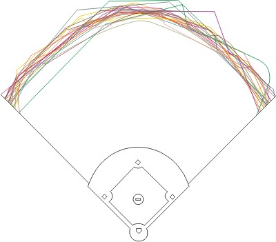

```{r setup, include=FALSE}
knitr::opts_chunk$set(echo = FALSE)
library(tidyverse)
library(broom)
library(lubridate)
library(forcats)
library(knitr)
```

## Overview

- Data/Terminology
- Using Park Factors for Prediciton
- Interactive Player Profiles

<div class="centered">

</div>

## Data - Fangraphs

1. Export game-by-game stats for top 30 MLB hitters in 2016
    + Join each player into one dataset
2. Cluster games by stadium and merge with park data
3. Recalculate <u>**rate statistics**</u>

```{r, eval=TRUE, echo=FALSE, message=FALSE, warning=FALSE, fig.width=8, fig.height=4.5}
  renderImage({

    image_file <- "fangraphs_snip.png"

    return(list(
      src = image_file, 
      filetype = "image/jpeg",
      height = 200, 
      width = 750
    ))

  }, deleteFile = FALSE)
```

## Terminology

- **Batting Average**
    + hits / at-bats

- **Total Bases**
    + (1 x 1B) + (2 x 2B) + (3 x 3B) + (4 x HR)

- **Slugging Percentage**
    + total bases / at-bats

- **HR/AB**
    + home runs / at-bats

## Basic Park Factor (BFP)

* Pitchers Park vs. Hitters Park:
    + Dimensions, Elevation, Temperature
* A league average park factor is set to 100
    + 105 BPF means that park produces run scoring that is 10% higher than average
    
```{r, eval=TRUE, echo=FALSE, message=FALSE, warning=FALSE, fig.width=8, fig.height=2.9}
park_data <- read_csv(file="abstract_data.csv")
# Elevation source: http://www.espn.com/fantasy/baseball/story/_/page/mlbdk2k16_parkfactors/which-parks-most-least-favorable-fantasy-baseball-hitters-pitchers-mlb#ARI
# Park Factor source: fangraphs.com

ggplot(data = park_data, aes(x = `Basic_PF`, y = `Elevation_ft`, color = League)) +
  geom_point() + 
  scale_y_log10() +
  xlim(90, 120) +
  ggtitle("MLB Park Factors and Elevations")

###### Messy Data Cleaning ######

Altuve <- read_csv(file="Altuve.csv") %>% mutate(Name = "Altuve")
Arenado <- read_csv(file="Arenado.csv") %>% mutate(Name = "Arenado")
Betts <- read_csv(file="Betts.csv") %>% mutate(Name = "Betts")
Beltre <- read_csv(file="Beltre.csv") %>% mutate(Name = "Beltre")
Bogaerts <- read_csv(file="Bogaerts.csv") %>% mutate(Name = "Bogaerts")
Bradley <- read_csv(file="Bradley.csv") %>% mutate(Name = "Bradley")
Bryant <- read_csv(file="Bryant.csv") %>% mutate(Name = "Bryant")
Cabrera <- read_csv(file="Cabrera.csv") %>% mutate(Name = "Cabrera")
Cano <- read_csv(file="Cano.csv") %>% mutate(Name = "Cano")
Correa <- read_csv(file="Correa.csv") %>% mutate(Name = "Correa")
Crawford <- read_csv(file="Crawford.csv") %>% mutate(Name = "Crawford")
Donaldson <- read_csv(file="Donaldson.csv") %>% mutate(Name = "Donaldson")
Dozier <- read_csv(file="Dozier.csv") %>% mutate(Name = "Dozier")
Eaton <- read_csv(file="Eaton.csv") %>% mutate(Name = "Eaton")
Freeman <- read_csv(file="Freeman.csv") %>% mutate(Name = "Freeman")
Goldschmidt <- read_csv(file="Goldschmidt.csv") %>% mutate(Name = "Goldschmidt")
Kinsler <- read_csv(file="Kinsler.csv") %>% mutate(Name = "Kinsler")
Kipnis <- read_csv(file="Kipnis.csv") %>% mutate(Name = "Kipnis")
Lindor <- read_csv(file="Lindor.csv") %>% mutate(Name = "Lindor")
Machado <- read_csv(file="Machado.csv") %>% mutate(Name = "Machado")
Murphy <- read_csv(file="Murphy.csv") %>% mutate(Name = "Murphy")
Pedroia <- read_csv(file="Pedroia.csv") %>% mutate(Name = "Pedroia")
Ramirez <- read_csv(file="Ramirez.csv") %>% mutate(Name = "Ramirez")
Rizzo <- read_csv(file="Rizzo.csv") %>% mutate(Name = "Rizzo")
C.Seager <- read_csv(file="C.Seager.csv") %>% mutate(Name = "C.Seager")
K.Seager <- read_csv(file="K.Seager.csv") %>% mutate(Name = "K.Seager")
Segura <- read_csv(file="Segura.csv") %>% mutate(Name = "Segura")
Trout <- read_csv(file="Trout.csv") %>% mutate(Name = "Trout")
Turner <- read_csv(file="Turner.csv") %>% mutate(Name = "Turner")
Votto <- read_csv(file="Votto.csv") %>% mutate(Name = "Votto")

combo_player <- bind_rows(Altuve, Arenado, Betts, Beltre, Bogaerts, Bradley, 
                        Bryant, Cabrera, Cano, Correa, Crawford, Donaldson,
                        Dozier, Eaton, Freeman, Goldschmidt, Kinsler, Kipnis,
                        Lindor, Machado, Murphy, Pedroia, Ramirez, Rizzo, 
                        C.Seager, K.Seager, Segura, Trout, Turner, Votto)

combo_player <- combo_player %>% 
# Source: http://www.fangraphs.com/statsd.aspx?playerid=9777&position=3B
  mutate(
    Date = as.Date(stringr::str_sub(Date, 25, 34)),
    # If opponent variable includes "@" then park = opponent park, otherwise its own park
    Park = ifelse(stringr::str_detect(Opp, "@"), stringr::str_sub(Opp, 2, 4), Team),
    Home = ifelse(Park == Team, 1, 0)
  ) %>%
  
  select(-Team, -Opp, -Pos, -Date) %>% 
  group_by(Name, Park) %>%
  summarise_each(funs(sum)) %>% 
  mutate(
    TB = `1B` + (2 * `2B`) + (3 * `3B`) + (4 * HR),
    AVG = H / AB,
    Slug_Pct = TB / AB,
    HR_per_AB = HR / AB
  )

combo_player_park <- left_join(combo_player, park_data, by = "Park")

condensed_player_park <- combo_player_park %>% 
  group_by(Name) %>%
  select(-Park, -Team, -League) %>%
  mutate(
    weight_bpf = Basic_PF * G,
    weight_elev = Elevation_ft * G
  ) %>%
  summarise_each(funs(sum)) %>%
  # Need to recalculate the rate stats
  mutate(
    AVG = H / AB,
    Slug_Pct = TB / AB,
    HR_per_AB = HR / AB
  ) %>%
  mutate(
    Basic_PF = weight_bpf / G,
    Elevation_ft = weight_elev / G
  ) %>%
  select(-weight_bpf, -weight_elev)
```

## Using BPFs for Prediction

Regressing AVG on BPF to predict batting average

$$
AVG = \beta_0 + \beta_1 BPF
$$

```{r, eval=TRUE, echo=FALSE, message=FALSE, warning=FALSE, fig.width=8, fig.height=4.5}

# Fitting regression model:
predict_BA <- lm(AVG ~ Basic_PF, data = combo_player_park)

condensed_player_park <- condensed_player_park %>% 
  mutate(predict_AVG = predict(predict_BA, newdata = condensed_player_park, type = "response"))

condensed_player_park <- condensed_player_park %>% 
  mutate(Outperformance = AVG - predict_AVG)

avg_outperform <- condensed_player_park %>% 
  select(Name, AVG, predict_AVG, Outperformance, Basic_PF) %>% 
  arrange(desc(Outperformance)) %>% 
  mutate(Basic_PF = round(Basic_PF, 0)) %>% 
  rename(
    `Actual AVG` = AVG,
    `Predicted AVG` = predict_AVG,
    `Average PF` = Basic_PF
  )

head(avg_outperform, 5) %>% kable(digits = 3)
```

## Interactive Player Profiles

```{r, eval=TRUE, echo=FALSE, message=FALSE, warning=FALSE, fig.width=8, fig.height=4.5}
inputPanel(
  # Input Player
  selectInput("player", label = "Player:",
              c("Altuve", "Arenado", "Betts", "Beltre", "Bogaerts", "Bradley", 
                "Bryant", "Cabrera", "Cano", "Correa", "Crawford", "Donaldson", 
                "Dozier", "Eaton", "Freeman", "Goldschmidt", "Kinsler", "Kipnis", 
                "Lindor", "Machado", "Murphy", "Pedroia", "Ramirez", "Rizzo", 
                "C.Seager", "K.Seager", "Segura", "Trout", "Turner", "Votto"), 
              selected = "Arenado"),
  # Input Data Scope
  radioButtons("scope", label = "Data:", c("Stadium", "Home vs Away"), 
               select = "Stadium", inline = FALSE),
  # Input Chart Type
  radioButtons("chart_type", label = "Chart Type:", c("Batting Average",
               "Home Runs per AB", "Slugging Percentage"),
               select = "Batting Average", inline = FALSE)
)

mainPanel(
  fluidRow(splitLayout(cellWidths = c("25%", "125%"),
                       
  renderImage({

    image_file <- paste(input$player, "png", sep = ".")

    return(list(
      src = image_file, 
      filetype = "image/jpeg",
      height = 100, 
      width = 130
    ))

  }, deleteFile = FALSE),

  renderPlot({
  
  # Fake Inputs
  input_player <- "Arenado"
  input_data <- "Stadium"
  input_chart <- "Batting Average"
  
  player_file <- paste(input$player, "csv", sep = ".")
  
  app_player <- read_csv(file = player_file) %>%
  # Source: http://www.fangraphs.com/statsd.aspx?playerid=9777&position=3B
    mutate(
      Date = as.Date(stringr::str_sub(Date, 25, 34)),
      Park = ifelse(stringr::str_detect(Opp, "@"), stringr::str_sub(Opp, 2, 4), Team),
      Home = ifelse(Park == Team, 1, 0)
    ) %>%
  
    select(-Team, -Opp, -Pos, -Date) %>%
    group_by(Park) %>%
    summarise_each(funs(sum)) %>%
    mutate(
      TB = `1B` + (2 * `2B`) + (3 * `3B`) + (4 * HR),
      AVG = H / AB,
      Slug_Pct = TB / AB,
      HR_per_AB = HR / AB
    )
  
  park_data <- read_csv(file="abstract_data.csv")
  player_park <- left_join(app_player, park_data, by = "Park")
  
  home_away <- player_park %>%
      group_by(Home) %>%
      select(-Park, -Team, -League) %>%
      mutate(
        weight_bpf = Basic_PF * G,
        weight_elev = Elevation_ft * G
      ) %>%
      summarise_each(funs(sum)) %>%
      # Need to recalculate the rate stats
      mutate(
        AVG = H / AB,
        Slug_Pct = TB / AB,
        HR_per_AB = HR / AB
      ) %>%
      mutate(
        Basic_PF = weight_bpf / G,
        Elevation_ft = weight_elev / G,
        Home = ifelse(Home == 0, "Away", "Home")
      ) %>%
      select(-weight_bpf, -weight_elev)
  
  ############################################################  
  
  # Plot Chart 
  
  ifelse(input$scope == "Stadium",
  
    ifelse(input$chart_type == "Batting Average",
           
        (plot = ggplot(data = player_park, aes(x = reorder(Team, AVG), 
                                               y = AVG, fill = as.factor(Basic_PF))) +
                  geom_bar(stat = "identity") +
                  labs(x = "Stadium", y = "Batting Avg. (# of ABs above bar)",
                       title = "Batting Average by Stadium") +
                  geom_abline(color = "red", slope = 0,
                              intercept = (sum(player_park$H) / sum(player_park$AB)))),
  
      ifelse(input$chart_type == "Slugging Percentage", 
             
        (plot = ggplot(data = player_park, aes(x = reorder(Team, Slug_Pct),
                                               y = Slug_Pct, fill = as.factor(Basic_PF))) +
                  geom_bar(stat = "identity") +
                  labs(x = "Stadium", y = "Slugging % (# of ABs above bar)",
                       title = "Slugging Percentage by Stadium") +
                  geom_abline(color = "red", slope = 0,
                              intercept = (sum(player_park$TB) / sum(player_park$AB)))),
  
        (plot = ggplot(data = filter(player_park, HR != 0), 
                       aes(x = reorder(Team, HR_per_AB), y = HR_per_AB, 
                           fill = as.factor(Basic_PF))) +
                  geom_bar(stat = "identity") +
                  labs(x = "Stadium", y = "HR/AB (# of ABs above bar)",
                       title = "Home Runs per At-Bat by Stadium") +
                  geom_abline(color = "red", slope = 0,
                              intercept = (sum(player_park$HR) / sum(player_park$AB))))
      )
    ),
  
    ifelse(input$chart_type == "Batting Average",
           
        (plot = ggplot(data = home_away, aes(x = Home, y = AVG)) +
                  geom_bar(stat = "identity", width = 0.5, 
                           fill = c("dark red", "dark blue")) +
                  labs(x = "Stadium", y = "Batting Avg.",
                       title = "Batting Average by Stadium") +
                  coord_cartesian(ylim=c(0.0, 0.4)) +
                  geom_text(aes(label = round(AVG, 3)), vjust = -0.5, size = 7)),
  
      ifelse(input$chart_type == "Slugging Percentage", 
             
        (plot = ggplot(data = home_away, aes(x = Home, y = Slug_Pct)) +
                  geom_bar(stat = "identity", width = 0.5, 
                           fill = c("dark red", "dark blue")) +
                  labs(x = "Stadium", y = "Slugging %",
                       title = "Slugging Percentage by Stadium") +
                  coord_cartesian(ylim=c(0.0, 0.8)) +
                  geom_text(aes(label = round(Slug_Pct, 3)), vjust = -0.5, size = 7)),
  
        (plot = ggplot(data = home_away, aes(x = Home, y = HR_per_AB)) +
                  geom_bar(stat = "identity", width = 0.5, 
                           fill = c("dark red", "dark blue")) +
                  labs(x = "Stadium", y = "HR/AB",
                       title = "Home Runs per At-Bat by Stadium") +
                  coord_cartesian(ylim=c(0.0, 0.1)) +
                  geom_text(aes(label = round(HR_per_AB, digits = 3)), vjust = -0.5, size = 7))
      )
    )
  )
  
  ifelse(input$scope == "Stadium",
    (plot = plot +
      theme(title = element_text(size = 15),
            axis.text.x = element_text(angle = -60, hjust = 0, size = 15), 
            axis.text.y = element_text(size = 10),
            axis.title.x = element_text(margin=margin(20,0,0,0), size = 15),
            axis.title.y = element_text(margin=margin(0,20,0,0), size = 15),
            legend.title = element_text(size = 12),
            legend.text = element_text(size = 10)) +
      geom_text(aes(label = AB), vjust = -0.2, size = 4.5) +
      scale_fill_grey(name = "Basic\nPark\nFactor", start = 0.9, end = 0.2)),
    
    (plot = plot +
      theme(title = element_text(size = 15),
            axis.text.x = element_text(size = 15), 
            axis.text.y = element_text(size = 10),
            axis.title.x = element_text(margin=margin(20,0,0,0), size = 15),
            axis.title.y = element_text(margin=margin(0,20,0,0), size = 15)) +
      scale_x_discrete(labels=c("Away" = paste("Away\nBPF = ",
                                               round(home_away$Basic_PF[1], 0), 
                                               sep = ""), 
                                "Home" = paste("Home\nBPF = ", 
                                               round(home_away$Basic_PF[2], 0), 
                                               sep = ""))))
  )

  plot
}, height = 375, width = 625)
)))
```

## Comparisons

```{r, eval=TRUE, echo=FALSE, message=FALSE, warning=FALSE, fig.width=8, fig.height=4.5}
inputPanel(
  # Input Comparison
  radioButtons("compare", label = "Comparison:", c("Arenado vs. Cano",
               "C. Seager vs. K. Seager"),
               select = "Arenado vs. Cano", inline = FALSE),
  # Input Chart Type
  radioButtons("chart", label = "Chart Type:", c("Batting Average",
               "Home Runs per AB", "Slugging Percentage"),
               select = "Batting Average", inline = FALSE)
)

mainPanel(
  renderPlot({
  
  # Fake Inputs
  input_compare <- "C. Seager vs. K. Seager"
  input_chart_type <- "Batting Average"
  
  name_1 <- ifelse(input$compare == "Arenado vs. Cano", "Arenado", "C.Seager")
  name_2 <- ifelse(input$compare == "Arenado vs. Cano", "Cano", "K.Seager")
  
  compare_app <- bind_rows(Arenado, Cano, C.Seager, K.Seager) %>%
    filter(Name == name_1 | Name == name_2) %>% 
    mutate(
      Date = as.Date(stringr::str_sub(Date, 25, 34)),
      Park = ifelse(stringr::str_detect(Opp, "@"), stringr::str_sub(Opp, 2, 4), Team),
      Home = ifelse(Park == Team, 1, 0), 
      Name = ifelse(Name == "Cano", "Cano (96)", 
             ifelse(Name == "Arenado", "Arenado (118)",
             ifelse(Name == "C.Seager", "C.Seager (95)", "K.Seager (96)")))
    ) %>%
  
    select(-Team, -Opp, -Pos, -Date) %>%
    group_by(Name, Park) %>%
    summarise_each(funs(sum)) %>%
    mutate(TB = `1B` + (2 * `2B`) + (3 * `3B`) + (4 * HR))
  
  park_data <- read_csv(file="abstract_data.csv")
  compare_app <- left_join(compare_app, park_data, by = "Park")
  
  compare_app <- compare_app %>%
      group_by(Name, Home) %>%
      select(-Park, -Team, -League) %>%
      mutate(
        weight_bpf = Basic_PF * G,
        weight_elev = Elevation_ft * G
      ) %>%
      summarise_each(funs(sum)) %>%
      # Need to recalculate the rate stats
      mutate(
        AVG = H / AB,
        Slug_Pct = TB / AB,
        HR_per_AB = HR / AB
      ) %>%
      mutate(
        Basic_PF = weight_bpf / G,
        Elevation_ft = weight_elev / G,
        Home = ifelse(Home == 0, "Away", "Home")
      ) %>%
      select(-weight_bpf, -weight_elev)
  
  ############################################################  
  
  # Plot Chart 

  ifelse(input$chart == "Batting Average",
         
      (plot = ggplot(data = compare_app, aes(x = Home, y = AVG, fill = Name)) +
                geom_bar(stat = "identity", position = "dodge") +
                labs(x = "Stadium", y = "Batting Avg.",
                     title = "Batting Average by Stadium") +
                coord_cartesian(ylim=c(0.0, 0.4))),

    ifelse(input$chart == "Slugging Percentage", 
           
      (plot = ggplot(data = compare_app, aes(x = Home, y = Slug_Pct, fill = Name)) +
                geom_bar(stat = "identity", position = "dodge") +
                labs(x = "Stadium", y = "Slugging %",
                     title = "Slugging Percentage by Stadium") +
                coord_cartesian(ylim=c(0.0, 0.8))),

      (plot = ggplot(data = compare_app, aes(x = Home, y = HR_per_AB, fill = Name)) +
                geom_bar(stat = "identity", position = "dodge") +
                labs(x = "Stadium", y = "HR/AB",
                     title = "Home Runs per At-Bat by Stadium") +
                coord_cartesian(ylim=c(0.0, 0.1)))
    )
  )
  
  plot = plot +
    theme(title = element_text(size = 15),
          axis.text.x = element_text(size = 15), 
          axis.text.y = element_text(size = 10),
          axis.title.x = element_text(margin=margin(20,0,0,0), size = 15),
          axis.title.y = element_text(margin=margin(0,20,0,0), size = 15),
          legend.text = element_text(size = 12)) +
    scale_fill_discrete(name = "Name &\n(Home BPF)")
  plot
}, height = 375, width = 750)
)
```

## Potential Next Steps

- Accounting for weather, temperature, time of year, etc.
- Incorporating data for pitchers
- Expanding number of players in dataset
