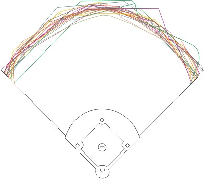
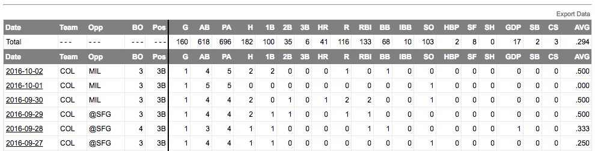

```{r setup, include=FALSE}
knitr::opts_chunk$set(echo = TRUE)
library(tidyverse)
library(broom)
library(lubridate)
library(forcats)
library(knitr)
```

# Importance of MLB Park Factors



Unlike most other sports, baseball does not require all stadiums to have the same dimensions. While the distance between the pitcher's mound and home plate, as well as the distances between bases, must be the same in every stadium, the rest of the dimensions are for the park designers to decide. Factors like distances and [heights of the walls](https://c1.staticflickr.com/1/64/156079118_6560c8bd33_b.jpg), the amount of space behind home plate, and [the location of the bullpens](https://www.youtube.com/watch?v=6HL0vSd8LVU) are unique in all 30 Major League Baseball stadiums. 

Additionally, factors such as elevation, typical wind patterns, and temperature all drastically impact every baseball game. At higher elevations the air tends to be thinner, causing less resistance on the baseball and resulting in harder and farther hits. At colder temperatures, pitchers have a more difficult time gripping balls, benefiting hitters, but balls also tend not to travel as well off the bat, benefitting pitchers. The direction and severity of the wind can carry a ball over the fence or knock it down into fair territory.

For my project, I set out to analyze how these stadium factors affected Major League hitters. One statistic that was created in attempt to measure stadium effects is Basic Park Factor (BPF). The league average BPF is set to 100, and a BPF of 105 indicates that a park produces run scoring that is 10% higher than the league average. Therefore, the larger the BPF, the easier it should be for hitter to perform. The chart below plots the BPF of every MLB Park against the stadium’s elevation. While 29 of the 30 parks fall between a BPF of 95 and 105, one stadium is a clear outlier: Coors Field in Denver, Colorado, home of the Colorado Rockies. 

At Coors Field, the altitude is over 5000 feet. Since the park opened in 1995, it has become known as quite possibly the greatest hitter’s park in baseball history. [Denver's thin air causes Coors to see some of longest home runs hit each year](https://www.youtube.com/watch?v=E5X8V_Lsgjo). Rockies hitters almost always enjoy better success at home than on the road, and pitchers across the league seem to struggle when they visit Coors Field. In fact, the Rockies organization began placing game balls in a [humidor](https://en.wikipedia.org/wiki/Humidor) in attempt to add humidity to the baseballs to prevent them from flying out of the stadium at a blistering pace. [While changes to the park over the years have scaled down some of the hitter friendly aspects](http://www.fangraphs.com/blogs/changes-are-coming-to-coors-field/), Coors remains the best hitter’s park in baseball.

```{r, eval=TRUE, echo=FALSE, message=FALSE, warning=FALSE, fig.width=8, fig.height=4.5}
park_data <- read_csv(file="abstract_data.csv")

ggplot(data = park_data, aes(x = `Basic_PF`, y = `Elevation_ft`, color = League)) +
  geom_point() + 
  scale_y_log10() +
  xlim(90, 120) +
  ggtitle("MLB Park Factors and Elevations") +
  labs(x = "Basic Park Factor", y = "Elevation (ft)")
```

# Gathering Data and Combining Datasets

In order to analyze the impact of each stadium, I needed to use game-level data from MLB hitters. [Fangraphs](http://www.fangraphs.com/) allows users to export game-by-game data from every MLB player. Since the game logs required a different export for each player, it is difficult to gather data for many players in an efficient manner. My solution was to analyze only the best hitters in baseball. I took the [top 30 hitters according to Wins Above Replacement ](http://www.fangraphs.com/leaders.aspx?pos=all&stats=bat&lg=all&qual=y&type=8&season=2016&month=0&season1=2016&ind=0&team=0&rost=0&age=0&filter=&players=0) (a complex success statistic), and exported each player’s game log.

Once I had all the player data I needed, I was able to combine the individual datasets by binding rows together. Like any raw data, the file required cleaning, but using the various dplyr techniques and commands, the data was easily converted into a refined dataset. In order to create the visualizations I wanted to display, I then needed to duplicate the combined player dataset and group the observations by player and stadium. I was then able to add the park data for each player/stadium grouping in the combined player dataset.

For the analysis in this presentation, I focused on three rate statistics. The calculations for the statistics are as follows:

- **Batting Average** = Number of Hits / Number of At-Bats
- **Slugging Percentage** = Number of Total Bases / Number of At-Bats
    - Total Bases = (1 x 1B) + (2 X 2B) + (3 X 3B) + (4 X HR)
- **Home Runs per At-Bat** = Number of Home Runs / Number of At-Bats

A snip of a Fangraphs game log is shown below and a sample Fangraphs player page can be found [here](http://www.fangraphs.com/statsd.aspx?playerid=10155&position=OF&type=1&gds=&gde=&season=2016). Using date, text, and number manipulation, I was able to adjust this output into a cleaned and condensed dataset.



```{r, eval=TRUE, echo=FALSE, message=FALSE, warning=FALSE, fig.width=8, fig.height=4.5}
# Converting player csv files
Altuve <- read_csv(file="Altuve.csv") %>% mutate(Name = "Altuve")
Arenado <- read_csv(file="Arenado.csv") %>% mutate(Name = "Arenado")
Betts <- read_csv(file="Betts.csv") %>% mutate(Name = "Betts")
Beltre <- read_csv(file="Beltre.csv") %>% mutate(Name = "Beltre")
Bogaerts <- read_csv(file="Bogaerts.csv") %>% mutate(Name = "Bogaerts")
Bradley <- read_csv(file="Bradley.csv") %>% mutate(Name = "Bradley")
Bryant <- read_csv(file="Bryant.csv") %>% mutate(Name = "Bryant")
Cabrera <- read_csv(file="Cabrera.csv") %>% mutate(Name = "Cabrera")
Cano <- read_csv(file="Cano.csv") %>% mutate(Name = "Cano")
Correa <- read_csv(file="Correa.csv") %>% mutate(Name = "Correa")
Crawford <- read_csv(file="Crawford.csv") %>% mutate(Name = "Crawford")
Donaldson <- read_csv(file="Donaldson.csv") %>% mutate(Name = "Donaldson")
Dozier <- read_csv(file="Dozier.csv") %>% mutate(Name = "Dozier")
Eaton <- read_csv(file="Eaton.csv") %>% mutate(Name = "Eaton")
Freeman <- read_csv(file="Freeman.csv") %>% mutate(Name = "Freeman")
Goldschmidt <- read_csv(file="Goldschmidt.csv") %>% mutate(Name = "Goldschmidt")
Kinsler <- read_csv(file="Kinsler.csv") %>% mutate(Name = "Kinsler")
Kipnis <- read_csv(file="Kipnis.csv") %>% mutate(Name = "Kipnis")
Lindor <- read_csv(file="Lindor.csv") %>% mutate(Name = "Lindor")
Machado <- read_csv(file="Machado.csv") %>% mutate(Name = "Machado")
Murphy <- read_csv(file="Murphy.csv") %>% mutate(Name = "Murphy")
Pedroia <- read_csv(file="Pedroia.csv") %>% mutate(Name = "Pedroia")
Ramirez <- read_csv(file="Ramirez.csv") %>% mutate(Name = "Ramirez")
Rizzo <- read_csv(file="Rizzo.csv") %>% mutate(Name = "Rizzo")
C.Seager <- read_csv(file="C.Seager.csv") %>% mutate(Name = "C.Seager")
K.Seager <- read_csv(file="K.Seager.csv") %>% mutate(Name = "K.Seager")
Segura <- read_csv(file="Segura.csv") %>% mutate(Name = "Segura")
Trout <- read_csv(file="Trout.csv") %>% mutate(Name = "Trout")
Turner <- read_csv(file="Turner.csv") %>% mutate(Name = "Turner")
Votto <- read_csv(file="Votto.csv") %>% mutate(Name = "Votto")

# Combining players into one dataset
combo_player <- bind_rows(Altuve, Arenado, Betts, Beltre, Bogaerts, Bradley, 
                        Bryant, Cabrera, Cano, Correa, Crawford, Donaldson,
                        Dozier, Eaton, Freeman, Goldschmidt, Kinsler, Kipnis,
                        Lindor, Machado, Murphy, Pedroia, Ramirez, Rizzo, 
                        C.Seager, K.Seager, Segura, Trout, Turner, Votto)

# Cleaning combined player dataset
combo_player <- combo_player %>% 
  mutate(
    Date = as.Date(stringr::str_sub(Date, 25, 34)),
    # If opponent variable includes "@" then park = opponent park, otherwise its own park
    Park = ifelse(stringr::str_detect(Opp, "@"), stringr::str_sub(Opp, 2, 4), Team),
    Home = ifelse(Park == Team, 1, 0)
  ) %>%
  select(-Team, -Opp, -Pos, -Date) %>% 
  group_by(Name, Park) %>%
  summarise_each(funs(sum)) %>% 
  # Recalculating rate stats
  mutate(
    TB = `1B` + (2 * `2B`) + (3 * `3B`) + (4 * HR),
    AVG = H / AB,
    Slug_Pct = TB / AB,
    HR_per_AB = HR / AB
  )

# Joining park data
combo_player_park <- left_join(combo_player, park_data, by = "Park")


condensed_player_park <- combo_player_park %>% 
  group_by(Name) %>%
  select(-Park, -Team, -League) %>%
  # Used to average elevation and BPF later
  mutate(
    weight_bpf = Basic_PF * G,
    weight_elev = Elevation_ft * G
  ) %>%
  summarise_each(funs(sum)) %>%
  # Recalculating rate stats
  mutate(
    AVG = H / AB,
    Slug_Pct = TB / AB,
    HR_per_AB = HR / AB
  ) %>%
  # Averaging elevation and BPF
  mutate(
    Basic_PF = weight_bpf / G,
    Elevation_ft = weight_elev / G
  ) %>%
  select(-weight_bpf, -weight_elev)
```

# Outperformance - Regression for Prediction

To begin analyzing how the top MLB hitters trend across different ballparks, I decided to regress batting average, slugging percentage, and home runs per at-bat on BPF to observe how well stadium effects work as a predictor. The regression equation for batting average is shown below:

$$
AVG = \beta_0 + \beta_1 BPF
$$

I anticipated that all three statistics would be positively correlated with BPF, but I anticipated higher correlation when observing slugging percentage and home runs per at-bat. In general, however, I did not believe that any of the relationships would have strong adjusted R-squared values, as stadium effects are not the only factor that impacts a hitter’s performance. The resulting adjusted R-squared values from the regressions are as follows:

- **Batting Average**: 0.008169
- **Slugging Percentage**: 0.0125
- **Home Runs per At-Bat**: 0.002616

As expected, none of the values are relatively strong. However, it is interesting to note that HR/AB showed the lowest value. This could be a result of hitters who may not be “power” hitters but who play in stadiums with a high BPF.

To predict each statistic on a per player basis, I grouped the data by player name and recalculated all rate statistics, including average BPF over the course of the entire season. The resulting dataset consisted of 30 observations (1 per player) with each player’s season stats and average BPF. Using this dataset, I predicted the three statistics using the regression model. The charts below show the top five players in terms of outperformance of prediction in each statistic.

```{r, eval=TRUE, echo=FALSE, message=FALSE, warning=FALSE, fig.width=8, fig.height=4.5}
# Fitting regression models:
predict_BA <- lm(AVG ~ Basic_PF, data = combo_player_park)
predict_Slug <- lm(Slug_Pct ~ Basic_PF, data = combo_player_park)
predict_HRpAB <- lm(HR_per_AB ~ Basic_PF, data = combo_player_park)

# Predicting stats using models from above
condensed_player_park <- condensed_player_park %>% 
  mutate(predict_AVG = predict(predict_BA, newdata = condensed_player_park, 
                               type = "response")) %>% 
  mutate(predict_Slug = predict(predict_Slug, newdata = condensed_player_park, 
                                type = "response")) %>%
  mutate(predict_HRpAB = predict(predict_HRpAB, newdata = condensed_player_park, 
                                 type = "response"))

# Calculating outperformance
condensed_player_park <- condensed_player_park %>% 
  mutate(`AVG Outperformance` = AVG - predict_AVG) %>% 
  mutate(`Slugging Outperformance` = Slug_Pct - predict_Slug) %>% 
  mutate(`HR/AB Outperformance` = HR_per_AB - predict_HRpAB)

# Cleaning data for output tables
outperform <- condensed_player_park %>% 
  select(Name, AVG, Slug_Pct, HR_per_AB, predict_AVG, predict_Slug, predict_HRpAB, 
         `AVG Outperformance`, `Slugging Outperformance`, `HR/AB Outperformance`, 
         Basic_PF) %>%
  mutate(Basic_PF = round(Basic_PF, 0)) %>% 
  rename(
    `Actual AVG` = AVG,
    `Actual Slugging %` = Slug_Pct,
    `Actual HR/AB` = HR_per_AB,
    `Predicted AVG` = predict_AVG,
    `Predicted Slugging %` = predict_Slug,
    `Predicted HR/AB` = predict_HRpAB,
    `Average PF` = Basic_PF
  )

# Cleaning for AVG table
avg_outperform <- outperform %>%
  select(Name, `Actual AVG`, `Predicted AVG`, 
         `AVG Outperformance`, `Average PF`) %>% 
  arrange(desc(`AVG Outperformance`))

# Cleaning for Slugging % table
slug_outperform <- outperform %>%
  select(Name, `Actual Slugging %`, `Predicted Slugging %`, 
         `Slugging Outperformance`, `Average PF`) %>% 
  arrange(desc(`Slugging Outperformance`))

# Cleaning for HR/AB table
hr_outperform <- outperform %>%
  select(Name, `Actual HR/AB`, `Predicted HR/AB`, 
         `HR/AB Outperformance`, `Average PF`) %>% 
  arrange(desc(`HR/AB Outperformance`))
```

### Batting Average

```{r, eval=TRUE, echo=FALSE, message=FALSE, warning=FALSE, fig.width=8, fig.height=4.5}
head(avg_outperform, 5) %>% kable(digits = 3)
```

### Slugging Percentage

```{r, eval=TRUE, echo=FALSE, message=FALSE, warning=FALSE, fig.width=8, fig.height=4.5}
head(slug_outperform, 5) %>% kable(digits = 3)
```

### Home Runs per At-Bat

```{r, eval=TRUE, echo=FALSE, message=FALSE, warning=FALSE, fig.width=8, fig.height=4.5}
head(hr_outperform, 5) %>% kable(digits = 3)
```

Four players show up in two of the top-5 charts: Daniel Murphy (avg and slugging), Mike Trout (avg and slugging), Miguel Cabrera (slugging and HR/AB), and Kris Bryant (slugging and HR/AB). These results are not surprising. Kris Bryant was nearly voted the unanimous 2016 National League Most Valuable Player, receiving 29 of 30 first place votes. The runner up and the player that received the remaining first place vote: Daniel Murphy. Mike Trout was the 2016 American League MVP, winning the award for the second time in three years, and is regarded by many as the best player in all of baseball. Miguel Cabrera, a two-time MVP, is a future hall of famer who has appeared in 11 all-star games and received at least one MVP vote in all 14 of his MLB seasons.

# Player Profiles

To analyze how each player performed across MLB stadiums, I decided to create an interactive app that creates visualizations for different statistics and data. I used the there statistics discussed in the previous section and created two breakdowns of data: stadium and home vs. away. 

The stadium data breaks down player performance by each stadium in which the player recorded an at-bat. For instance, in a 162 game season, a player may only play in 20 of the 30 MLB stadiums. The issue with stadium data is sample size. In a player’s home stadium, they will have enough at-bats for a useful sample; in a full, healthy season, a player will record more than 300 home at-bats. However, in road stadiums, a player will record significantly less. For teams in a player’s division (each league is broken down into 3 divisions with 5 teams in each), a player will typically record between 30 and 40 at-bats. In out-of-division stadiums, a player will like have less than 20 at-bats. This causes difficulty when looking at stadium level data. 

Despite the small sample sizes, there are still some patterns that can be seen at this level. The stadium level charts include several helpful visualizations. The darkness of the bars represents the BPF of the particular stadium. The darker bars coincide with higher BPFs, thus a more hitter-friendly stadium. The number of at-bats a player recorded in each stadium is shown above the bars. This makes it easy to see which stadium is the home stadium and which stadiums are division stadiums. The red line represents the player’s overall average for each statistic in 2016. This allows users to easily see where a player outperformed his average in each statistic. 

One point to keep in mind is the tendency to regress toward the mean. The bar representing each player’s home stadium should sit somewhere close to the red line. This is intuitive, as a player’s home stadium will significantly contribute to the overall average of the statistic. Another point to keep in mind is a player’s handedness. For instance, many stadiums play to one field better than the other. At Fenway Park in Boston, the left field wall (which stands 38 feet high) stands closer than any other left field wall in baseball. This allows right-handed hitters to collect base-hits off the wall on fly balls that would normally be caught in other stadiums. On the other side of the field, the right field fence stands much farther from home plate, making it more difficult for left-handed hitters. Thus, two Red Sox hitters that bat from different sides of the plate may see different levels of success at their home stadium.

The home vs. away data allows for another level of analysis. Breaking down the data by home vs. away creates relatively even sample sizes for each category. The home vs. away chart includes the average BPF beneath the x-axis, allowing users to see what type of stadium a player typically plays in at home and on the road. The away BPF is a weighted average BPF, weighted by at-bats in each stadium.

As expected, most players tend to perform better at home if their home BPF is higher than their average road BPF and vice versa. Player likes Nolan Arenado (Colorado Rockies, 118 BPF) and Mookie Betts (Boston Red Sox, 105 BPF) seem to benefit significantly from playing in hitter friendly stadiums, while players like Robinson Cano (Seattle Mariners, 96 BPF) and Justin Turner (Los Angeles Dodgers, 95 BPF) seem to suffer from playing in pitcher-friendly parks. Almost every player in the sample shows better statistics in the category with the higher BPF, which is consistent with expectations. There are a few players that do not fit the trend, however. The most obvious example is Los Angeles Dodgers' shortstop Corey Seager. Seager, who won the 2016 National League Rookie of the Year award, performed significantly better at Dodger Stadium (95 BPF) than on the road (101 avg. BPF). Dodger Stadium is known as a pitcher’s park, but is said to be easier on left-handed hitters, like Seager, than it is on right-handed hitters.

The remainder of the players can be explored in the player profile shiny app. The app is at the bottom of this page in order to avoid formatting difficulties.

# Conclusions and Potential Next Steps

The analysis points toward fairly strong stadium effects for the top MLB hitters. Most hitters that play in hitter-friendly stadiums enjoy a boost in their statistics when they play at home. Similarly, most hitters that play in pitcher-friendly parks see their output suffer when playing at home. While these effects are not homogenous for the entire sample, there does appear to be some substance behind the benefit of playing in hitter friendly parks.

How might this impact further baseball analysis? First, it shows that when looking at a player’s statistics, scouts and teams should certainly include a player’s home stadium effects. The casual fan can get away with ignoring basic park factors, but when truly evaluating a player’s performance, the qualities and characteristics of each MLB stadium in which he plays must be accounted for. Additionally, stadium effects could impact where free agents choose to play when signing a new contract. Pitchers looking for a one-year deal in order to improve their numbers in hopes for a bigger contract will almost always avoid signing with the Rockies because of the impact of Coors Field. In fact, the Rockies have a difficult time convincing any pitcher to come or stay in Colorado.

This analysis only scratches the surface of this topic. There are several next steps that could improve and expand the analysis in this project. One example would be to incorporate pitcher data. The quality of pitchers has an enormous impact on a hitter’s success, and has the ability to skew data when looking only at stadium effects. There could also be improvements made on the sample size. Including more players or more years will give more data per stadium. Additionally, the dataset can be expanded to explicitly include factors such as weather, temperature, time of day, and wind. While BPF aims to encapsulate all of these factors, explicitly gathering such data and incorporating it in the dataset could improve the reliability of the findings.

Sources:

- [Fangraphs](http://www.fangraphs.com/): player data, [park factors](http://www.fangraphs.com/guts.aspx?type=pf&teamid=0&season=2015) and game log snip
- [ESPN](http://www.espn.com/mlb/): player profile images, [stadium elevations](http://www.espn.com/fantasy/baseball/story/_/page/mlbdk2k16_parkfactors/which-parks-most-least-favorable-fantasy-baseball-hitters-pitchers-mlb)
- [Snippets](http://snippets.com/how-different-are-major-league-baseball-fields.htm): MLB stadiums image

# Player Profiles Shiny App

```{r, echo=FALSE, echo=FALSE, message=FALSE, warning=FALSE, fig.width=8, fig.height=4.5}
inputPanel(
  # Input Player
  selectInput("player", label = "Player:",
              c("Altuve", "Arenado", "Betts", "Beltre", "Bogaerts", "Bradley", 
                "Bryant", "Cabrera", "Cano", "Correa", "Crawford", "Donaldson", 
                "Dozier", "Eaton", "Freeman", "Goldschmidt", "Kinsler", "Kipnis", 
                "Lindor", "Machado", "Murphy", "Pedroia", "Ramirez", "Rizzo", 
                "C.Seager", "K.Seager", "Segura", "Trout", "Turner", "Votto"), 
              selected = "Arenado"),
  # Input Data Scope
  radioButtons("scope", label = "Data:", c("Stadium", "Home vs Away"), 
               select = "Stadium", inline = FALSE),
  # Input Chart Type
  radioButtons("chart_type", label = "Chart Type:", c("Batting Average",
               "Home Runs per AB", "Slugging Percentage"),
               select = "Batting Average", inline = FALSE)
)

mainPanel(
  fluidRow(splitLayout(cellWidths = c("25%", "125%"),
                       
  renderImage({
    # Creating player profile images
    image_file <- paste(input$player, "png", sep = ".")

    return(list(
      src = image_file, 
      filetype = "image/jpeg",
      height = 200, 
      width = 200
    ))

  }, deleteFile = FALSE),
  
  renderPlot({
    
    # Fake Inputs
    input_player <- "Arenado"
    input_data <- "Stadium"
    input_chart <- "Batting Average"
    
    # Using input to retrieve corresponding player data
    player_file <- paste(input$player, "csv", sep = ".")
    
    # Cleaning data - same as shown earlier
    app_player <- read_csv(file = player_file) %>%
      mutate(
        Date = as.Date(stringr::str_sub(Date, 25, 34)),
        Park = ifelse(stringr::str_detect(Opp, "@"), stringr::str_sub(Opp, 2, 4), Team),
        Home = ifelse(Park == Team, 1, 0)
      ) %>%
      select(-Team, -Opp, -Pos, -Date) %>%
      group_by(Park) %>%
      summarise_each(funs(sum)) %>%
      mutate(
        TB = `1B` + (2 * `2B`) + (3 * `3B`) + (4 * HR),
        AVG = H / AB,
        Slug_Pct = TB / AB,
        HR_per_AB = HR / AB
      )
    
    park_data <- read_csv(file="abstract_data.csv")
    player_park <- left_join(app_player, park_data, by = "Park")
    
    # Grouping data into Home vs. Away and cleaning
    home_away <- player_park %>%
        group_by(Home) %>%
        select(-Park, -Team, -League) %>%
        mutate(
          weight_bpf = Basic_PF * G,
          weight_elev = Elevation_ft * G
        ) %>%
        summarise_each(funs(sum)) %>%
        # Recalculating rate stats
        mutate(
          AVG = H / AB,
          Slug_Pct = TB / AB,
          HR_per_AB = HR / AB
        ) %>%
        mutate(
          Basic_PF = weight_bpf / G,
          Elevation_ft = weight_elev / G,
          Home = ifelse(Home == 0, "Away", "Home")
        ) %>%
        select(-weight_bpf, -weight_elev)
    
    ############################################################  
    
    # Plot Chart
    
    ifelse(input$scope == "Stadium",
    
      ifelse(input$chart_type == "Batting Average",
          
          # Chart = Stadium, AVG
          (plot = ggplot(data = player_park, aes(x = reorder(Team, AVG), 
                                                 y = AVG, fill = as.factor(Basic_PF))) +
                    geom_bar(stat = "identity") +
                    labs(x = "Stadium", y = "Batting Avg. (# of ABs above bar)",
                         title = "Batting Average by Stadium") +
                    # creating average line:
                    geom_abline(color = "red", slope = 0,
                                intercept = (sum(player_park$H) / sum(player_park$AB)))),
    
        ifelse(input$chart_type == "Slugging Percentage", 
          
          # Chart = Stadium, Slugging %  
          (plot = ggplot(data = player_park, aes(x = reorder(Team, Slug_Pct),
                                                 y = Slug_Pct, fill = as.factor(Basic_PF))) +
                    geom_bar(stat = "identity") +
                    labs(x = "Stadium", y = "Slugging % (# of ABs above bar)",
                         title = "Slugging Percentage by Stadium") +
                    geom_abline(color = "red", slope = 0,
                                intercept = (sum(player_park$TB) / sum(player_park$AB)))),
    
          # Chart = Stadium, HR/AB
          (plot = ggplot(data = filter(player_park, HR != 0), 
                         aes(x = reorder(Team, HR_per_AB), y = HR_per_AB, 
                             fill = as.factor(Basic_PF))) +
                    geom_bar(stat = "identity") +
                    labs(x = "Stadium", y = "HR/AB (# of ABs above bar)",
                         title = "Home Runs per At-Bat by Stadium") +
                    geom_abline(color = "red", slope = 0,
                                intercept = (sum(player_park$HR) / sum(player_park$AB))))
        )
      ),
    
      ifelse(input$chart_type == "Batting Average",
             
          # Chart = Home vs. Away, AVG
          (plot = ggplot(data = home_away, aes(x = Home, y = AVG)) +
                    geom_bar(stat = "identity", width = 0.5, 
                             fill = c("dark red", "dark blue")) +
                    labs(x = "Stadium", y = "Batting Avg.",
                         title = "Batting Average by Stadium") +
                    coord_cartesian(ylim=c(0.0, 0.4)) +
                    geom_text(aes(label = round(AVG, 3)), vjust = -0.5, size = 10)),
    
        ifelse(input$chart_type == "Slugging Percentage", 
               
          # Chart = Home vs. Away, Slugging %
          (plot = ggplot(data = home_away, aes(x = Home, y = Slug_Pct)) +
                    geom_bar(stat = "identity", width = 0.5, 
                             fill = c("dark red", "dark blue")) +
                    labs(x = "Stadium", y = "Slugging %",
                         title = "Slugging Percentage by Stadium") +
                    coord_cartesian(ylim=c(0.0, 0.8)) +
                    geom_text(aes(label = round(Slug_Pct, 3)), vjust = -0.5, size = 10)),
    
          # Chart = Home vs. Away, HR/AB
          (plot = ggplot(data = home_away, aes(x = Home, y = HR_per_AB)) +
                    geom_bar(stat = "identity", width = 0.5, 
                             fill = c("dark red", "dark blue")) +
                    labs(x = "Stadium", y = "HR/AB",
                         title = "Home Runs per At-Bat by Stadium") +
                    coord_cartesian(ylim=c(0.0, 0.1)) +
                    geom_text(aes(label = round(HR_per_AB, digits = 3)), vjust = -0.5, size = 10))
        )
      )
    )
    
    ifelse(input$scope == "Stadium",
           
      # Stadium level plot logistics
      (plot = plot +
        theme(title = element_text(size = 25),
              axis.text.x = element_text(angle = -60, hjust = 0, size = 20), 
              axis.text.y = element_text(size = 15),
              axis.title.x = element_text(margin=margin(20,0,0,0), size = 25),
              axis.title.y = element_text(margin=margin(0,20,0,0), size = 25),
              legend.title = element_text(size = 15),
              legend.text = element_text(size = 12)) +
        geom_text(aes(label = AB), vjust = -0.2, size = 5) +
        scale_fill_grey(name = "Basic\nPark\nFactor", start = 0.9, end = 0.2)),
      
      # Home vs. Away level plot logistics
      (plot = plot +
        theme(title = element_text(size = 25),
              axis.text.x = element_text(size = 20), 
              axis.text.y = element_text(size = 15),
              axis.title.x = element_text(margin=margin(20,0,0,0), size = 25),
              axis.title.y = element_text(margin=margin(0,20,0,0), size = 25)) +
        # Displaying avg. BPF for home and away on x axis
        scale_x_discrete(labels=c("Away" = paste("Away\nBPF = ",
                                                 round(home_away$Basic_PF[1], 0), 
                                                 sep = ""), 
                                  "Home" = paste("Home\nBPF = ", 
                                                 round(home_away$Basic_PF[2], 0), 
                                                 sep = ""))))
    )
  
    plot
  }, height = 600, width = 1000)
)))
```
